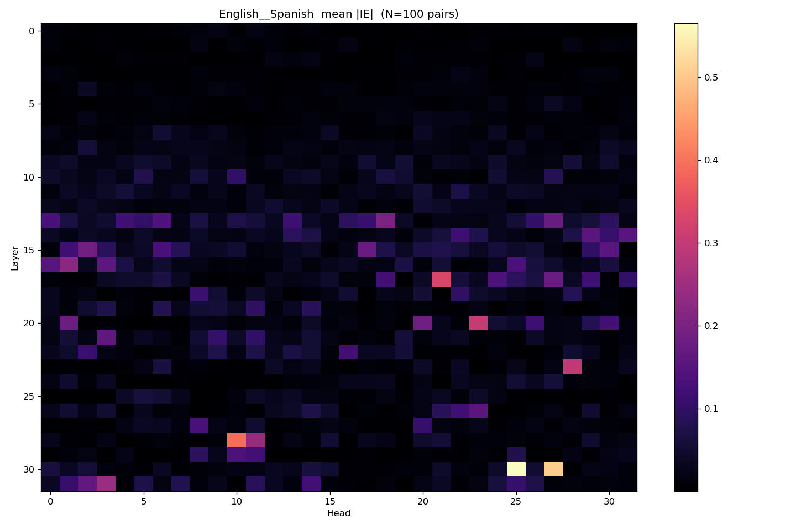
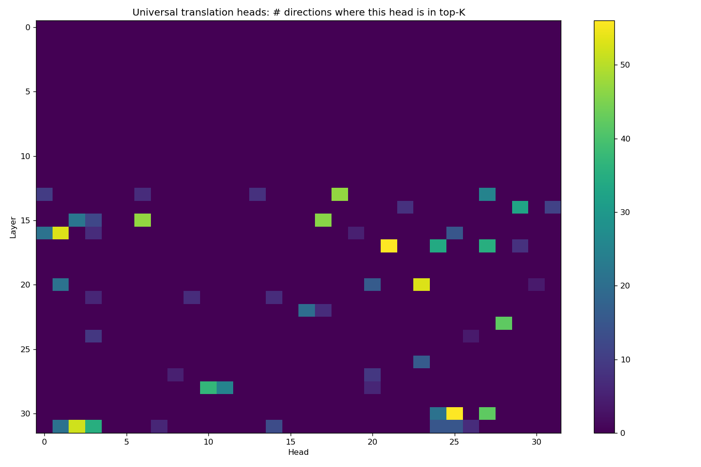

# Rendering test — markdown

Sanity check that VSCode's markdown preview on SCC handles the `img/` paths
correctly. If these images render in the preview pane, we can use the same
pattern for the qualitative-harness output reports.

## Per-direction figures (English → Spanish)

### Mean-abs IE heatmap (heads)

### Signed mean IE heatmap (heads)

### Top-20 heads bar

### Top-50 SAE features bar

## Cross-direction figure

### Universal heads heatmap (directions-in-top-K per (layer, head))

