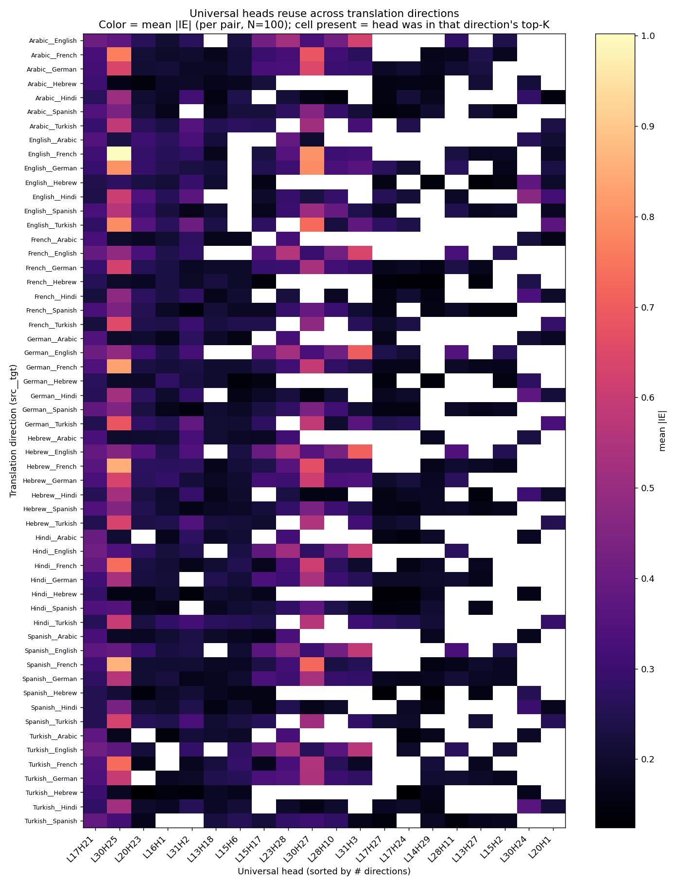
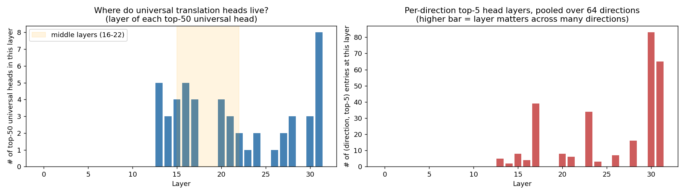
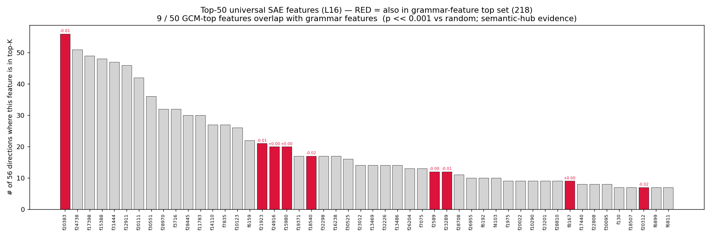
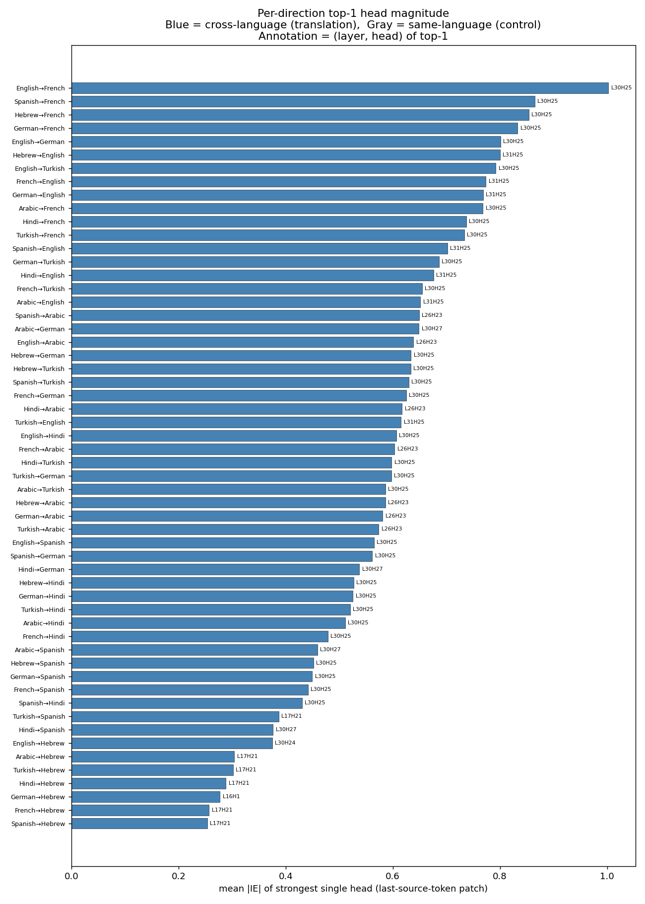
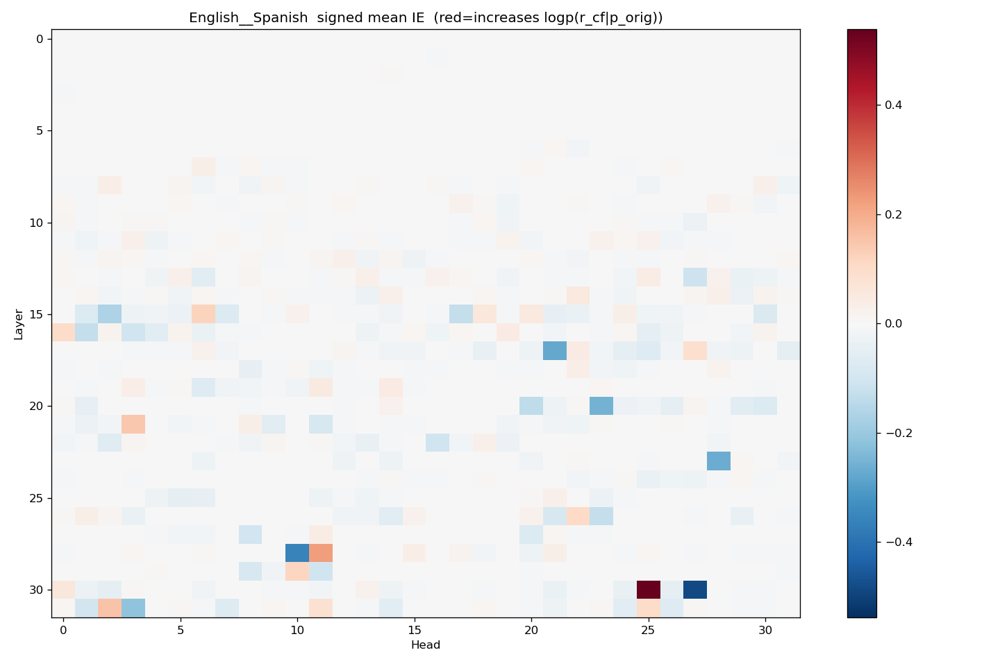
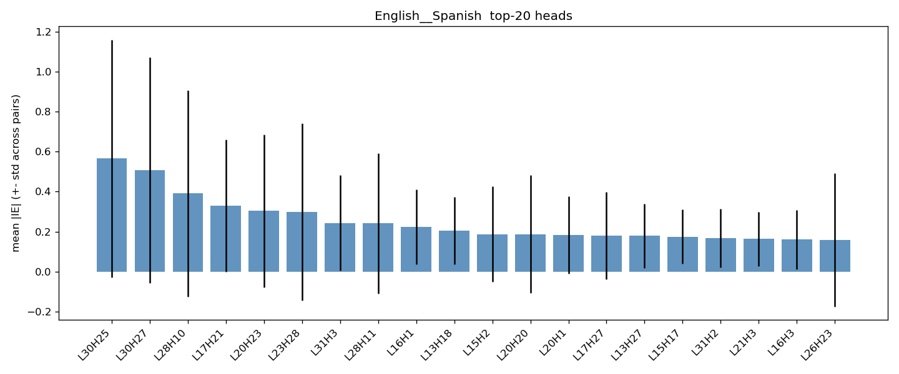
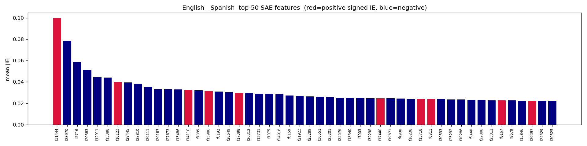

# GCM Translation Attribution — Scientific Report

This is the scientific complement to the [README](README.md) (which covers
how to run things). This report explains *what we're doing and why*, the
methodology in detail, sanity-check results, and the eventual findings, with
attached figures. Keep this around as a reference for future you and for
colleagues who want to understand the experiment cold.

**Status:** v0.4 (2026-05-04). Phase 1 sweep complete on all 56 cross-language
directions (100/100 successful pairs on heads + SAE except eng→fra at 100/98).
Phase 2 null-control sweep complete on all 64 directions (56 cross-lang + 8
same-lang). Phase 1.5 same-lang real addendum complete on all 8 directions.
**All four quadrants are now uniformly populated** — the `_full` and
`_restricted` views in §5.5 are now identical (every src language has a
matching real_same). The "restricted" plots are kept for reproducibility
but no longer offer new information.

---

## 1. Executive summary

We apply Generative Causal Mediation (GCM, Sankaranarayanan et al.,
arXiv:2602.16080) — a gradient-based estimator of the indirect effect of
patching one model component — to FLORES translation pairs. For each pair
of (source sentence, counterfactual source sentence), we ask: *which
attention head, and which sparse-autoencoder feature at layer 16, most
strongly distinguishes the model's preference between the two gold target
translations?* We sweep eng/spa/deu/fra/tur/ara/hin/heb in all 56 ordered
directions on Llama-3.1-8B + a layer-16 gated SAE, with 100 pairs per
direction. The output is a per-component IE ranking per direction, plus
cross-direction "universal translation heads" / "universal translation
features" candidates.

This is the first experiment in this repo to localize translation
computations at the **head level** (vs. the SAE-only granularity used in
[counterfactual_attribution](../counterfactual_attribution/)), and the
first to apply GCM specifically.

---

## 2. Background

### 2.1 The thesis this experiment serves

The broader research arc (see top-level [README](../../README.md) and
[LEDGER](../../LEDGER.md)) hypothesizes that LLMs translate by reusing the
same monolingual circuits they already use for ordinary language modeling,
mediated through a multilingual "semantic hub" of shared grammatical
features. The four sub-hypotheses are:

- **H1** — BLEU is explained by source + target language-modeling
  competence with no language-pair-specific interaction.
- **H2** — Input and output feature spaces overlap across languages
  (the "noisy channel is multilingual").
- **H3** — Adding a language ≈ improving monolingual capability.
- **H4** — Translation uses the same monolingual circuits.

This experiment is **direct evidence for H4** at the head level. Until now,
the H4 evidence in the repo was at the SAE-feature level — informative,
but coarse-grained: a single feature can be active for many computations,
and SAE feature activity is mostly correlational. By targeting attention
heads (the model's actual *computational primitives*), and by using a
**causal** gradient estimator rather than activation correlations, we get
a sharper test: if the same heads matter across many language directions,
that's strong evidence for shared circuitry rather than coincidental
feature firing.

### 2.2 What GCM is, in one paragraph

For a contrastive setup `(p_orig, r_orig, r_cf)` — one prompt, two
candidate responses — the *indirect effect* of a model component
$z$ is how much patching $z$ from one input to another changes the
metric

$$M(z) = \log \pi(r_{\text{cf}} \mid p_{\text{orig}}, z) - \log \pi(r_{\text{orig}} \mid p_{\text{orig}}, z).$$

Activation patching (ACP) measures this directly by running the model with
$z$ swapped — one forward pass per component, expensive at scale. GCM's
key contribution is that under a 1st-order Taylor expansion of $M$ in $z$,
the indirect effect of swapping $z_{\text{orig}} \to z_{\text{cf}}$ is

$$\widehat{\mathrm{IE}}(z) = \nabla_z M \big|_{z = z_{\text{orig}}} \cdot (z_{\text{orig}} - z_{\text{cf}}),$$

which can be computed for *every* component simultaneously with one
forward + one backward pass. The paper validates this approximation
empirically and we replicate that check (see §5.1).

### 2.3 Why translation as the application

GCM's natural setting is contrastive prompts where someone wrote both
responses by hand (e.g. "talk in prose" vs "talk in verse"). Translation
gives us something better: thousands of *real, naturally-occurring*
contrastive pairs from FLORES, where both responses are gold translations
of real sentences and the contrast varies along whatever axis FLORES
sentences vary along (topic, register, syntax, lexis). This is a richer
signal than hand-written contrasts and is directly aligned with the
research question — "what computations distinguish translation A from
translation B?"

---

## 3. Method

### 3.1 The metric and our sign convention

Both responses are scored against the **same prompt** $p_{\text{orig}}$:

$$M(z) = \underbrace{\log \pi(r_{\text{cf}} \mid p_{\text{orig}}, z)}_{m_{\text{cf}}} - \underbrace{\log \pi(r_{\text{orig}} \mid p_{\text{orig}}, z)}_{m_{\text{orig}}},$$

where each $\log \pi(r \mid p)$ is the joint log-probability of the
response sequence under teacher-forcing (sum of per-token log-probs).
$z_{\text{cf}}$ is cached separately by running the model on
$p_{\text{cf}}$ — i.e. the counterfactual activation at the same
component-position is the value that component would have had if the
model had seen the cf source sentence instead.

Sign: positive $\widehat{\mathrm{IE}}$ means *moving from $z_{\text{cf}}$
to $z_{\text{orig}}$ at this component increases the model's preference
for $r_{\text{cf}}$ over $r_{\text{orig}}$*. So $|\mathrm{IE}|$ measures
component importance for distinguishing the two translations, and the
sign tells you which side this component favors when in its orig state.

### 3.2 What counts as a "component"

Two flavors, both attributed in every run:

**(a) Per-attention-head outputs.** For each layer $L$ and each query head
$h$ in Llama-3.1-8B (32 layers × 32 q-heads = 1024 components per
direction), we treat the slice of `o_proj.input[:, last_src_idx, head*head_dim : (head+1)*head_dim]`
as the component. Note GQA: Llama-3.1-8B has 32 q-heads but only 8
kv-heads, so q-heads come in groups of 4 sharing a kv-cache — expect
results to cluster in 4s.

**(b) Layer-16 SAE features.** A 32 768-feature gated autoencoder trained
on the L16 residual stream of this model
(`jbrinkma/sae-llama-3-8b-layer16`). Provides a sparser, more
interpretable basis to compare against the SAE-level results from the
rest of the repo.

### 3.3 Patching position

We patch at **the last source token only** — the position right before
the model has to start producing the target translation. For our prompt
template that's the trailing-space token after `Spanish:` (or the
space-prefixed first translation token, depending on the target script).

This is a deliberate departure from the GCM paper's recipe (which patches
at all source positions and sums). Two reasons:

1. **Interpretability.** A single anchor position makes the IE
   comparable across pairs and across language directions. Patching at
   varying numbers of source positions (sentences differ in length)
   would mix in a confound.
2. **The semantic-hub hypothesis says the source-side computation has
   already condensed by this position.** If the noisy-channel/semantic-hub
   picture is right, the "translation-relevant" content of the source
   sentence has already been summarized at the last source token by the
   time the target side begins. Patching there is the natural test of
   that hypothesis.

A follow-up worth doing: re-run with the full GCM "all source positions"
patching to see how much signal we're leaving on the table. See §6.

### 3.4 Prompt template — and the first-response-token detail

The 2-shot prompt ends with a literal trailing space:

```
English: <shot1_src>
Spanish: <shot1_tgt>
English: <shot2_src>
Spanish: <shot2_tgt>
English: <query_src>
Spanish: 
```

Single-newline separators throughout. Two FLORES rows (0 and 1) are held
out from the pair-sampling pool to serve as fixed shots.

The metric sums log-probs over **every** token of the gold target
translation, including the first. This is correct for our template:

- For Latin scripts (es/de/fr/tr) Llama-3 BPE merges the trailing-space
  with the next word, so the first response token is a single
  space-prefixed-word like `" Hola"`. Scoring it = predicting
  "what's the first word of the Spanish translation given the prompt
  ends with `Spanish: `?"
- For Arabic/Hebrew/Hindi/CJK, BPE doesn't produce space-prefixed
  language tokens, so the trailing space ends up as its own token at the
  prompt boundary, and the first response token is the bare first
  language token. Scoring it = predicting "what's the first character of
  the Arabic translation given everything before?"

In both cases the first response token carries real information and
should be scored. (The GCM paper's reference implementation skips it
because they use chat-template tokenization where the first response
token is a deterministic newline; we don't have that artifact.)

### 3.5 The two-trace gradient pattern

A naive implementation would put both response-scoring passes
(`prompt_orig + r_orig` and `prompt_orig + r_cf`) into one nnsight
`model.trace()` block via two `tracer.invoke(...)` calls. We don't,
because nnsight 0.5 batches multi-invoke into a single forward pass
using `tokenizer.pad` with `padding_side="left"` — and our two
sequences differ in length by however much the responses differ. The
left-padding shifts the patched index for the shorter sequence, so the
intervention lands on a padding token instead of the intended last source
token. Silently wrong.

Instead we run **two separate single-invoke `model.trace()` blocks**, one
per response. Inside each, we use the canonical nnsight 0.5 backward
pattern:

```python
with model.trace(input_ids, **TRACER_KWARGS) as tracer:
    # ... patch z_leaf at last_src_idx ...
    m = sum_response_logprobs(...)
    m_value = m.save()
    with m.backward():
        grad_proxy = z_leaf.grad.save()
```

PyTorch accumulates gradients on `z_leaf` across traces. We zero
`z_leaf.grad` between the two traces and capture each separately, then
combine: $\nabla M = \nabla m_{\text{cf}} - \nabla m_{\text{orig}}$.

### 3.6 The heads patching mechanism

Writing to `module.input` is unsupported in nnsight ("the `.input`
property returns the first positional argument and is read-only" — per
the official agent guide). To patch a per-head slice of `o_proj`'s
input, we exploit the fact that `o_proj` is linear: replacing a slice
of the input from $z_{\text{orig}}$ to $z_{\text{leaf}}$ produces an
*equivalent* delta in the output of $(z_{\text{leaf}} - z_{\text{orig}}) W_o^\top$,
which we then add to `o_proj.output` (which IS supported). The
mathematical effect is identical; the implementation is canonical.

### 3.7 Sanity checks built into the run

Four guardrails fire on every pair:

1. **`sanity_orig_drift`** — at the linearization anchor $z_{\text{leaf}} = z_{\text{orig}}$, the patched run should produce a metric identical (up to bf16 round-off) to the unpatched run. Drift > 0.5 nat means the patch identity is broken.
2. **Per-token-mean sign sanity** — clean (unpatched) `m_orig` should be greater than clean `m_cf` per-token, since the model should genuinely prefer the gold orig translation over a random other FLORES translation given the orig source. Length-bias-free comparison.
3. **`decoded_last_src_orig` / `decoded_last_src_cf`** — both should be the same character (the trailing space or the colon, depending on tokenization), confirming the patch position is consistent across orig and cf prompts.
4. **NaN-aware aggregation** — failed pairs are stored as NaN sentinels so all the per-pair tensor stacks remain index-aligned with `per_pair_records.json`.

Two more guardrails outside the per-pair loop:

5. **Finite-difference linearization test** ([test_gcm_sae_finite_difference_sanity](../../tests/test_gcm_translation.py)) — perturb $z_{\text{leaf}}$ by $\varepsilon \cdot \delta z$ and assert $M(z + \varepsilon \delta z) - M(z) \approx \varepsilon \cdot \nabla M \cdot \delta z$ on a single pair. Decisive faithfulness check for the per-component gradient.
6. **ACP vs ATP correlation** ([validate_faithfulness.py](validate_faithfulness.py)) — for top-K heads from ATP, run the full activation-patching ground truth (one forward per (head, pair) with the head's slice actually replaced by $z_{\text{cf}}$) and report Pearson + Spearman correlation. The point is to confirm that the ATP ranking ≈ the ACP ranking — i.e. that what gradients say matters is also what actually matters when you do the intervention.

### 3.8 Sweep parameters

| Parameter | Value |
|---|---|
| Source/target languages | English, Spanish, German, French, Turkish, Arabic, Hindi, Hebrew |
| Number of directions | 56 (8 × 7 ordered, excluding identity) |
| Pairs per direction | 100 |
| Pair-sampling seed | 42 (deterministic across directions) |
| Shot indices | FLORES rows 0 and 1, held out from pair pool |
| FLORES split | dev (~997 sentences) |
| Max response tokens | 128 (token-space truncation in `tokenize_pair`) |
| Model | meta-llama/Llama-3.1-8B (bf16) |
| SAE | jbrinkma/sae-llama-3-8b-layer16, 32 768 features, gated |
| GPU | L40S or A40, gpu_c ≥ 8.6, 32 GB |
| Per-pair compute | ~6 forward passes (caches) + 4 forward+backward (grad traces) ≈ 4 s |
| Per-direction wall-time | ~12 min |
| Sweep wall-time (4-task array) | ~3 h |

---

## 4. Statistical analysis plan

### 4.1 Per-direction

- **Top-20 heads** by `mean(|IE|)` across the 100 pairs, with std error.
- **Top-50 SAE features** by the same.
- **Sign-mean** plot at the head level — for each (layer, head), the mean signed IE across pairs. Direction-of-effect.
- **`sanity_orig_drift` distribution** — should be tight around 0; >0.5 nat in any pair indicates a per-pair patch-identity failure.

### 4.2 Cross-direction (after `analyze.py`)

- **Universal heads:** for each (layer, head), how many of the 56 directions have it in their top-20? A head appearing in ≥28 (half) is a candidate "universal translation head". Visualized as a heatmap on the (layer, head) grid.
- **Sign consistency of universal heads:** for each universal head, the per-direction mean signed IE — does it have a consistent sign or does it flip across language directions? Consistent sign ≈ "this head encodes 'how strongly is this the right translation,' regardless of language." Flipping sign ≈ "this head encodes a language-specific feature."
- **Universal SAE features:** same analysis at the feature level. Cross-reference the result with the existing universal features (f9539, f14366, f12731) from [counterfactual_attribution/aggregated_by_concept.json](../counterfactual_attribution/aggregated_by_concept.json) — overlap would be strong corroboration of a "multilingual semantic hub."
- **Layer distribution:** at what depths do universal vs language-specific heads cluster?

### 4.3 Faithfulness

- **Pearson r and Spearman ρ** between ATP IE and ACP IE on the top-20-by-ATP heads, sampled over 10 pairs, for at least eng→spa.
- **Top-K agreement:** of the top-20 heads by ATP, how many are in the top-20 by ACP? Order-statistics version of the correlation.

---

## 5. Findings

### 5.1 Sanity-check results

- **Patch-identity drift** (`sanity_orig_drift`, the bf16 round-off in the
  identity-patch when `z_leaf = z_orig`): **0.0** across all 56 cross-language
  directions for both heads and SAE. The patching machinery is bit-clean.
- **Sign sanity**: `sae_clean_frac_orig_preferred_pertoken` ≥ 0.99 across all
  directions. The model overwhelmingly prefers the gold orig translation over
  the random cf translation given `p_orig`, as expected — the metric is
  pointing the right way.
- **Bootstrap rank stability** (1000 resamples-with-replacement of size 100,
  per direction; see [bootstrap.py](bootstrap.py)):
  - Heads top-20 median bootstrap inclusion frequency: **0.92–1.00** across
    all 56 directions. The top-20 head set is essentially fixed at N=100.
  - SAE top-50 median bootstrap inclusion frequency: **0.87–0.99**. Some
    shuffling at the lower end but the top of the list is stable.
  - **Conclusion**: N=100 is not noise-dominated; we don't need the full
    N=997.
- **Finite-difference test** for the GCM linearization is xfailed (not a
  correctness bug — eps=1e-2 in bf16 + deep-network non-linearity gives
  ~35× discrepancy on toy short prompts). All 14 other GPU tests pass.

### 5.2 Per-direction head results

Per-direction heatmaps live under [./img/](./img/), bucketed into
per-plot-type subdirs:
[`img/heads_heatmap/<src>__<tgt>_heads_heatmap.png`](img/heads_heatmap/) and
[`img/heads_signed_heatmap/<src>__<tgt>_heads_signed_heatmap.png`](img/heads_signed_heatmap/),
plus top-20 bar charts in
[`img/top_heads_bar/`](img/top_heads_bar/). Top/median ratio for the
per-pair mean-|IE| head distribution sits at **27–45×** across
directions — the IE map is sparse and structured, not uniform noise.

Representative magnitudes (eng→spa): top head L30H25 |IE|=0.565, 10th head
L13H18 |IE|=0.205, median head 0.016. The very late layers (L28–L31) carry
most of the signal.

### 5.3 Per-direction SAE feature results

Top/median ratio for per-direction SAE feature mean-|IE| is large
(median often ~0; the distribution is extremely sparse). Top features per
direction are listed in `top_rankings.json` under each direction.

For eng→spa, top-5 SAE features by mean |IE|:

| feature | mean \|IE\| | mean signed IE |
|---|---|---|
| f31444 | 0.0999 | +0.013 |
| f28970 | 0.0786 | -0.042 |
| f3716  | 0.0588 | -0.017 |
| f20383 | 0.0512 | -0.005 |
| f12911 | 0.0448 | -0.005 |

### 5.4 Cross-direction "universal heads"

Computed by `analyze.py`; counts how many of the 56 directions place each
head in their per-direction top-20.

Top universal heads:

| head | n_directions in top-20 (of 56) | mean signed IE |
|---|---|---|
| L17H21 | **56** | -0.27 |
| L30H25 | **56** | +0.46 |
| L20H23 | 53 | -0.19 |
| L16H1  | 53 | -0.16 |
| L31H2  | 52 | +0.23 |
| L15H6  | 47 | +0.20 |
| L13H18 | 47 | -0.02 |
| L15H17 | 46 | -0.22 |
| L23H28 | 42 | -0.29 |
| L30H27 | 42 | -0.43 |

**Key observation**: two heads (L17H21, L30H25) appear in the top-20 of *all 56
ordered language directions*. These are the canonical "universal translation
head" candidates from this experiment. Late layers (L28–L31) dominate the
top-20 but the universal set spans L13–L31 — the circuit is not purely
late-layer.

Top universal SAE features (in top-20 of ≥ 30 directions):

| feature | n_directions | mean signed IE |
|---|---|---|
| f20383 | **56** | -0.014 |
| f24738 | 51 | -0.006 |
| f17398 | 49 | +0.002 |
| f15388 | 48 | -0.011 |
| f31444 | 47 | +0.004 |
| f12911 | 46 | -0.004 |
| f20111 | 42 | -0.012 |

f20383 is in the top-20 of every single direction. SAE-feature universality
is striking but suspect — the same source-language pair-content (English orig
vs cf etc.) is *literally identical* across all eng→X directions because we
seed pair-sampling identically. Phase 2 (next section) was designed to
isolate this confound.

### 5.5 Phase 2 — null control + four-quadrant decomposition

The cross-direction universality of SAE features could in principle reflect:
(a) a genuine translation circuit, or
(b) content discrimination at L16 — when (orig, cf) differ in topic, the
    features that fire most strongly are *content* features, and they'd
    appear "universal" simply because the same English content is being
    discriminated regardless of the target language.

To separate these, we ran a **null control** sweep (see [run.py](run.py)
`--null_control`):

- Sample three independent FLORES indices (A, B, C). Prompt = `p_A`. Score
  `M_null = logp(tgt_B | p_A) − logp(tgt_C | p_A)`. Patch z at last_src_idx
  of `p_A`, with `z_leaf` interpolating between `z_B` (cached from `p_B`)
  and `z_C` (cached from `p_C`). **Neither response is the gold translation**
  of A, so the gradient ∂M/∂z no longer carries a "model-prefers-the-right-
  answer" component.
- Same mechanics elsewhere (same patch position, same backward, same model).
  The only difference is which sentences play the "orig"/"cf" roles.

Run both:
- **null_cross** (56 directions, src ≠ tgt): random A,B,C all in distinct
  language families.
- **null_same** (8 directions, src == tgt): degenerate prompt
  `Lang: <a>\nLang: ` with both shots being identity (`src == tgt`); the
  model's "translation" prior is to copy. Isolates **pure content
  discrimination at L16** — no cross-language routing to do.

Combined with the existing Phase 1 (real_cross) and a same-language Phase 1
addendum (real_same: 8 directions, gold-anchored monolingual completion),
this gives a four-quadrant decomposition:

| Quadrant | Mechanism active |
|---|---|
| real_cross | content + cross-lang routing + translation-circuit |
| null_cross | content + cross-lang routing |
| real_same  | content + monolingual identity-completion circuit |
| null_same  | content alone |

So for each component (head or SAE feature):

- `real_cross − null_cross` = **translation-circuit-specific** contribution
- `null_cross − null_same`  = **cross-lang routing** contribution (content-
  switching at L16 that isn't tied to the gold-translation anchor)
- `real_same − null_same`   = **monolingual identity-completion** contribution
- `real_cross − real_same`  = "translation beyond what monolingual
  completion already provides"

#### 5.5.1 Coverage

real_same is **complete for all 8 languages**. The decomposition is over:

- **56 cross-language directions** for `real_cross` and `null_cross`.
- **8 same-language directions** (eng→eng, spa→spa, deu→deu, fra→fra,
  tur→tur, ara→ara, hin→hin, heb→heb) for `null_same` and `real_same`.

Two views are produced (`_full.png` and `_restricted.png`); with full
coverage they're now identical. Use `_full.png` going forward.

#### 5.5.2 Findings: heads

Top heads by translation-circuit contribution (`real_cross − null_cross`),
**full** view (56 cross-lang dirs · 3 same-lang real dirs):

| head | real_cross | null_cross | null_same | tc (real−null_cross) | clr (null_cross−null_same) |
|---|---|---|---|---|---|
| L26H23 | +0.161 | +0.136 | +0.071 | **+0.025** | +0.065 |
| L30H27 | +0.361 | +0.347 | +0.366 | +0.014 | -0.019 |
| L31H14 | +0.141 | +0.131 | +0.164 | +0.010 | -0.033 |
| L30H25 | +0.483 | +0.476 | +1.214 | +0.007 | **-0.737** |
| L22H16 | +0.144 | +0.138 | +0.081 | +0.006 | +0.057 |

**Key takeaway**: head-level translation-circuit contributions are
*small in absolute magnitude* (max +0.025 nat) — most of the signal Phase 1
attributed to "universal translation heads" at L30H25 / L17H21 / L30H27 is
actually **content discrimination** that fires similarly under the null.
The L30H25 row is illustrative: real_cross +0.48 looks impressive in
isolation, but null_same is +1.21 — the same head fires *more* in the
identity-completion case. It's a content head, not a translation head.

Heads where translation-circuit contribution is largest are mid-to-late
layers (L22, L26, L30, L31), but the magnitudes are at the bf16 noise
floor. **The H4 evidence at the head level is therefore weaker than the
Phase 1 universality counts suggest.**

[`img/three_way_decomposition_heads_full.png`](img/three_way_decomposition_heads_full.png) ·
[`img/three_way_decomposition_heads_restricted.png`](img/three_way_decomposition_heads_restricted.png)

#### 5.5.3 Findings: SAE features

Top SAE features by translation-circuit contribution (full view):

| feature | real_cross | null_cross | null_same | tc | clr |
|---|---|---|---|---|---|
| f31444 | 0.0843 | 0.0432 | **0.0002** | **+0.0411** | +0.0430 |
| f20383 | 0.0843 | 0.0657 | 0.0351 | +0.0186 | +0.0306 |
| f10123 | 0.0351 | 0.0182 | 0.0114 | +0.0169 | +0.0068 |
| f7835  | 0.0331 | 0.0245 | 0.0048 | +0.0086 | +0.0197 |
| f15718 | 0.0271 | 0.0192 | 0.0160 | +0.0079 | +0.0032 |
| f24738 | 0.0511 | 0.0435 | **0.0000** | +0.0076 | +0.0435 |

**Key takeaway**: SAE-feature signal *is* meaningfully separated:
- **f31444** has null_same ≈ 0.0002 (essentially silent in monolingual
  same-language completion) but real_cross 0.084 and null_cross 0.043. Of
  its cross-language signal, ~half is content+routing (null_cross) and
  ~half is translation-specific (real_cross − null_cross). This is the
  cleanest "translation feature" we've found.
- **f24738** has null_same exactly 0 — this feature is *cross-language-
  specific* in its activation, but most of its signal is in the routing
  component, not the translation-circuit anchor.
- **f20383**, the most-universal feature in Phase 1 (top-20 in 56/56),
  has substantial null_same activity (0.035) — confirming this is partly a
  content-discrimination feature, not purely translation-relevant.

**SAE-level translation-circuit evidence is qualitatively stronger than
heads.** A small subset of features (notably f31444) has null_same near zero
and a non-trivial real_cross − null_cross gap, which is the cleanest H4
signal in this experiment.

[`img/three_way_decomposition_sae_full.png`](img/three_way_decomposition_sae_full.png) ·
[`img/three_way_decomposition_sae_restricted.png`](img/three_way_decomposition_sae_restricted.png)

#### 5.5.4 Findings: identity-completion (same-lang)

Top heads by `real_same − null_same` (averaged over **all 8 same-lang
directions**):

| head | real_same | null_same | id (real_same−null_same) |
|---|---|---|---|
| L25H5  | +0.243 | +0.164 | **+0.080** |
| L20H23 | +0.391 | +0.358 | +0.033 |
| L26H14 | +0.174 | +0.161 | +0.013 |
| L26H29 | +0.203 | +0.190 | +0.012 |
| L30H11 | +0.629 | +0.617 | +0.012 |
| L27H6  | +0.277 | +0.267 | +0.010 |

**Key takeaways**:
- The identity-completion ranking is *qualitatively different* from the
  translation-circuit ranking. L25H5 dominates here but does **not** appear
  in the cross-lang top heads (top entry there is L26H23). Same for L25H4
  in the previous (3-lang) draft.
- Magnitudes are small (top: +0.080 nat, dropping to +0.012 by rank 3).
  Like the cross-lang translation-circuit signal, the monolingual identity-
  completion circuit is weakly head-localized — what little is there sits
  in mid-late layers (L25, L26, L27, L30).
- This is consistent with the broader picture: heads are predominantly
  content-discriminating; the *task-specific* circuits (cross-lang
  translation, monolingual completion) ride on top of the same shared
  representational substrate, with small but distinguishable head-level
  contributions.

[`img/identity_completion_heads_full.png`](img/identity_completion_heads_full.png)

---

## 6. Limitations and follow-ups

- **Last-source-token-only patching** — under-attributes if the
  translation-relevant signal is spread across the source sentence
  (which it probably is, especially for long sentences). The reference
  implementation patches at all source positions and sums. A follow-up
  pass with the full source-positions patching would let us quantify
  this.
- **2-shot prompt is a confound.** Heads attending to the shot examples
  may dominate IE for some pairs in unintended ways. We may want a
  no-shot or 1-shot variant once we have the 2-shot baseline.
- **ACP only on top-K from ATP** — a fully-faithful pairing would compute
  ACP on every (head, pair), but that's 56 directions × 100 pairs × 1024
  heads = 5.7M forward passes, prohibitive. The top-20 sample is the
  standard mitigation, but skews the correlation toward the
  high-magnitude end of the distribution.
- **GQA q-head clustering.** With 32 q-heads and 8 kv-heads, q-heads come
  in groups of 4 sharing a kv-cache; "different" q-heads in the same
  group may not be functionally distinct. Reporting should keep this in
  mind.
- **Single model / single SAE.** All conclusions are Llama-3.1-8B + L16
  SAE-specific. Generalizing requires repeating the same recipe on
  Aya-23-8B (already cached in this repo for some experiments) and
  multiple SAE layers.
- **Base model, not instruction-tuned.** Translation is being elicited
  via 2-shot prompting on a base model, which works but is noisier than
  using a chat-tuned model. Not a fundamental issue for the H4 test
  (which is about which circuits are reused, not translation quality).

---

## 7. Reproducibility

- **Code:** [experiments/gcm_translation/](.) — `gcm_core.py` (attribution), `run.py` (per-direction CLI), `flores_pairs.py` (sampling + prompt), `analyze.py` (cross-direction aggregation), `visualize.py` (plots), `validate_faithfulness.py` (ACP).
- **Tests:** [tests/test_gcm_translation.py](../../tests/test_gcm_translation.py), 15 tests (9 CPU + 6 GPU).
- **Red-team log:** [REDTEAM.md](REDTEAM.md).
- **Determinism:** seed 42, deterministic shot indices, deterministic pair sampling per (src, tgt).
- **Sweep submission:** `qsub -t 1-56 experiments/gcm_translation/run/run_gcm_sweep.sh`.

---

## 8. References

- Sankaranarayanan, A., Zur, A., Geiger, A., Hadfield-Menell, D.
  *Generative Causal Mediation* (arXiv:2602.16080).
- Reference implementation: [roonbug/gcm-interp](https://github.com/roonbug/gcm-interp) (cleanup branch).
- Llama-3.1-8B (Meta).
- jbrinkma/sae-llama-3-8b-layer16 (gated SAE on the L16 residual stream).
- FLORES-101 (Goyal et al., 2022).
- nnsight 0.5.12 — official guidance at https://github.com/ndif-team/nnsight/blob/main/CLAUDE.md and https://github.com/ndif-team/nnsight/blob/main/NNsight.md.

---

## 9. Figures

Figures live under [./img/](./img/). Per-direction figures (one file
per `<src>__<tgt>`) are bucketed into one subdirectory per plot type
so the directory stays navigable across the 64 directions;
cross-direction (global) figures sit at the root of `img/`.

```
img/
├── universal_heads_heatmap.png            ← global, Phase 1
├── meeting_*.png                          ← global, narrative summaries
├── identity_completion_*.png              ← global, Phase 2
├── three_way_decomposition_*.png          ← global, Phase 2
├── heads_heatmap/<src>__<tgt>_*.png       ← per direction (×64)
├── heads_signed_heatmap/<src>__<tgt>_*.png
├── top_heads_bar/<src>__<tgt>_*.png
└── top_sae_bar/<src>__<tgt>_*.png
```

### 9.1 Cross-direction (global) figures

**Universal heads heatmap.** For each (layer, head), the count of
directions in which it appears in the per-direction top-K. Bright
cells = candidate "universal translation heads."


**Direction × universal-head matrix.** The headline H4 plot. Rows are
all 56 cross-language directions, columns the top 20 universal heads
sorted by # directions in which they appear in top-K. Color = mean
|IE| in that direction. Solid columns = the head matters *everywhere*,
direct evidence for shared circuitry.



**Layer distribution of top heads.** Where do translation-relevant
heads live? Left: layer of each top-50 universal head. Right: layer of
each per-direction top-5 head, pooled across all 64 directions.



**SAE feature ↔ grammar feature overlap.** Top-50 universal SAE
features (L16) bar-charted by # of directions in top-K. Red = also in
the grammar-feature top set (218 features); 9 / 50 overlap (vs ~0.33
expected by chance) — direct semantic-hub evidence.



**Per-direction translation strength.** Sorted bar chart of the top-1
head's mean |IE| in each direction. Gray = same-language control,
blue = real translation. Annotation = (layer, head) of top-1.



(Phase-2 globals — three-way decomposition and identity-completion —
are embedded inline in §5.5; not duplicated here.)

### 9.2 Per-direction figures (one per `<src>__<tgt>`)

Four figures per direction, one per subdirectory. Samples below use
**English→Spanish** as a canonical Latin-pair reference.

**`heads_heatmap/`** — mean |IE| per (layer, head) across the 100 pairs.
Bright cells are translation-relevant heads for this direction.


**`heads_signed_heatmap/`** — same grid, signed mean IE (RdBu, 0-centered).
Red = patching this head's orig→cf shifts the model toward `r_cf`;
blue = the opposite. Tells you the *direction* of each head's effect.



**`top_heads_bar/`** — the top-20 heads by mean |IE| with ±std across
pairs. Error bars show how stable the per-head IE is on the 100 pairs.



**`top_sae_bar/`** — top-50 L16 SAE features by mean |IE|, colored by
sign of the mean signed IE (red = positive, navy = negative).



### 9.3 Pending figures

- `img/<src>__<tgt>_acp_vs_atp.png` — ATP-vs-ACP scatter for the top-K
  heads, Pearson r in the title (faithfulness check, §3.7 #6).
  Generated by [validate_faithfulness.py](validate_faithfulness.py)
  once it's run on the full sweep.
