# Morning report — overnight multilingual SAE feature attribution

_Session: 2026-04-22 (overnight). Script outputs at `outputs/counterfactual_attribution/`, scripts at `experiments/counterfactual_attribution/` and `experiments/ablation/`._

---

## 0. What this session was

**Goal.** Take the English-only prototype for "find SAE features responsible for grammatical concept X" and extend it to French, Spanish, Turkish, and Arabic. For each top feature per `(language, concept, value)` cell, characterize it several ways so we can tell whether features transfer across languages (supporting the H4 "translation ≈ reused monolingual circuits" story), whether they flip meaning between languages (against H2 "one shared feature per concept"), and whether they are causally necessary for the model's predictions (not just statistically correlated).

**Model + SAE.** `meta-llama/Llama-3.1-8B` with a Gated SAE at layer 16 (`jbrinkma/sae-llama-3-8b-layer16`, 32768 features). The SAE is a sparse over-complete dictionary: given a 4096-dim residual-stream activation `x` at layer 16, the SAE encodes `x → z ∈ ℝ^32768` (most entries zero or near-zero), and decodes `z → x̂` so that `x̂ ≈ x`. A "feature" is one of the 32768 latent dimensions; we think of each as a directionally-interpretable concept.

---

## 1. TL;DR (read this first)

1. **Feature 9539 is universal.** It ranks top-50 by attribution in **every** `(concept, value)` cell of **every** language we tested: eng 10/11, fra 6/6, spa 6/6, tur 4/4, ara 8/8. Nearby universal features: f14366, f12731, f3650, f10870, f24916. Likely explanation: these are **general grammatical-prediction features** that fire whenever the model is about to choose between two morphologically-related forms, rather than carrying any specific concept meaning. This is a surprise and a mild confound for every concept-specific claim. See §4.1 and §6.

2. **Causal validation works.** Ablating the top-20 attribution features (zeroing them in SAE latent space) drops `logP(correct token)` by 0.5–3 nats on held-out pairs; the same ablation on 20 randomly chosen SAE features changes logP by roughly 0. Effect-ratio of 100–1000× over the random baseline is routine. This tells us the attribution is identifying genuinely load-bearing features, not spurious correlates. See §4.4.

3. **Turkish Number=Sing anomaly.** Ablating the top-20 features **increases** `logP(correct)` by +1.05 — the opposite of every other language/cell. Mixed signs in the top-20 signed `grad × act` (net +0.08 vs. Spanish's +0.33) partly explains it but not fully. Flagged for investigation; could be a Turkish-agglutinative-morphology quirk, a sign-convention bug specific to this cell, or a real finding. See §7 and TODO.

4. **Sign-flip across languages is real.** In the top-200 features by attribution magnitude, fra vs ara Gender=Masc shows 121 opposite-sign features (44% flip rate); ara vs tur Number=Sing shows 96 (33%); fra vs spa Number=Plur shows 61 (21%). Interpretation: the same SAE latent dimension is being used with *opposite* directional meaning in different languages — evidence *against* a clean "one feature = one multilingual concept" picture. See §4.3.

5. **Arabic dual → English "two/both/pair": honest null.** Features that attribute strongly to Arabic Number=Dual do **not** fire preferentially on English sentences mentioning "two/both/pair" vs. numeric-free controls (Cohen's d = −0.075 vs. density-matched random-feature null at +0.003). Evidence against naive H4 reuse for dual-number specifically. See §4.2.

6. **Cross-concept feature reuse is pervasive.** Across languages, dozens of features appear in the top-50 of 2+ concept cells at Bonferroni-corrected p < 0.01 (e.g. Arabic: 57 such features across 8 cells). Most striking: several features are in top-50 of *all* 8 Arabic cells — the "universal grammatical-prediction" story from finding 1. See §4.1.

---

## 2. Method, explained

### 2.1 The core idea — gradient attribution

For a sentence pair `(prefix, original_token, counterfactual_token)` — e.g. `"The cats"`, `" sit"`, `" sits"` — we want to know **which SAE features at layer 16 are responsible for the model preferring `original_token` over `counterfactual_token`**.

Define the loss

```
L(prefix) = logP(original_token | prefix) − logP(counterfactual_token | prefix)
```

A positive `L` means the model prefers original (as it should for grammatical inputs). Now run the forward pass in three stages:

1. Normal forward to the layer-16 residual stream: `x = layer_16_out(prefix)`.
2. SAE encode: `z = encode(x)` — sparse 32768-dim feature activations.
3. SAE decode + rest of model: `x̂ = decode(z)`, then we **replace** the layer-16 output with `x̂ + (x − x̂)` and continue forward to the logits. (The `x − x̂` term is the SAE reconstruction residual; adding it back ensures the forward pass downstream is unchanged at the operating point.)

Now we can ask: how does `L` change if we perturb a single feature activation `z_i`? Taking gradients:

```
∂L/∂z_i   at the operating point z = encode(x)
```

**Feature ranking — what `grad × act` means.** We rank features by the magnitude of `z_i × ∂L/∂z_i`. This is the **first-order Taylor approximation of the change in L** if we were to set `z_i := 0` (zero-ablation): `L(z_i ← 0) − L(z_i) ≈ −z_i × ∂L/∂z_i`. So `|grad × act|` is a cheap proxy for "how much would L drop if we zeroed this feature?" — i.e. an **indirect-effect measure at the zero baseline**. This is *not* the two-pass attribution-patching formula of Syed et al. (which uses `(a_clean − a_corrupt) · ∂L/∂a_clean` with a separately-run corrupted forward pass); we use the simpler, cheaper zero-baseline version. A Syed-style replication is in TODO.

**Sign convention.** `∂L/∂z_i > 0` means *increasing* feature `i` would *increase* L — i.e. feature `i` **promotes** the original token over the counterfactual. `grad × act > 0` similarly means the feature is contributing positively to the model's preference. We use signed values for sign-flip analysis (§4.3) and absolute values for ranking (§4.1, §4.4).

### 2.2 Token positions — where to read the logits

**Single-token counterfactual** (e.g. English " sit" vs " sits"): feed `prefix` alone. Let `T = len(tokenize(prefix))`. Then `logits[T-1]` predicts the next token (index-convention: `logits[i]` predicts the token at position `i+1`). So we measure `L` at `logits[-1]`.

**Multi-token counterfactual** (common for Arabic verbs, where e.g. `"يجتمعان"` tokenizes to 3 BPE pieces): we use the **last-BPE strategy**. If `original_token` tokenizes to `[o_1, ..., o_n]` and `counterfactual_token` to `[c_1, ..., c_m]`, we construct:

```
input = prefix_ids + [o_1, ..., o_{n-1}]
L     = logP(o_n | input) − logP(c_m | input)  computed at logits[-1]
```

That is, we pre-feed all but the last original-token BPE pieces, then compare just the last piece. This is an approximation — the more principled alternative would sum log-probs over the full counterfactual sequence (summed-logprob metric, TODO). Every downstream analysis reports a *full-pairs* view and, where relevant, a *single-token-only* view so you can see how much the multi-token approximation might be distorting results. See `bug_audit/tok_strategy_counts.png` — Arabic cells are almost entirely multi-token; French/Spanish/Turkish dominantly multi-token (via Romance participle agreement and Turkish agglutinative morphology); English is entirely single-token (the 30 handcrafted pairs were designed that way).

**Position of the gradient read-off.** We read `grad[cf_pos]` where `cf_pos = len(input_ids) − 1`. The old English-only pipeline hard-coded `-1` for the loss position but also aggregated gradients across *all* positions (via a sum) for its secondary ranking; we dropped that secondary ranking because summing gradients across positions mixes the concept-bearing position with early-sentence noise. `grad[cf_pos]` is the principled choice.

### 2.3 The Gated-SAE non-differentiability that wasn't

The GatedSAE's `encode` uses a Heaviside gate: `f_gate = (pi_gate > 0).float()`, which has no gradient. During planning we worried this would corrupt attribution. Reading the existing pipeline (`counterfactual_attribution.py` from the English-only prototype) we noticed it **sidesteps this entirely** by wrapping `encode` in `torch.no_grad()` and then treating the saved `z = encode(x)` as a **leaf variable** that `requires_grad`:

```python
# Step 1: cache z, no gradients
with torch.no_grad():
    z_saved = encode(x)

# Step 2: backprop through decode only
z = z_saved.detach().clone().requires_grad_(True)
x_hat = decode(z)
# ... rest of forward + L.backward()
```

So the gate is never in the gradient graph — `z.grad` is purely the derivative of L with respect to z treating z as an independent input. No STE fix needed. (The bug is still real if some other code *does* try to backprop through `encode` — flagged in TODO for future hygiene.)

### 2.4 Per-value aggregation (needed for sign-flip analysis)

For each `(lang_code, concept, concept_value_orig)` cell — e.g. `(fra, Gender, Masc)` — we aggregate per-pair `grad_cf` and `act_cf` tensors across pairs and save four views:

| Tensor | Meaning |
|---|---|
| `aggregated_signed.pt` | `mean_over_pairs(grad_cf)` — signed average gradient |
| `aggregated_abs.pt` | `mean_over_pairs(|grad_cf|)` — absolute average gradient |
| `aggregated_signed_gxa.pt` | `mean_over_pairs(grad_cf × act_cf)` — signed indirect effect |
| `aggregated_abs_gxa.pt` | `mean_over_pairs(|grad_cf × act_cf|)` — absolute indirect effect |

Rankings below use `aggregated_abs_gxa` (for "top features") and `aggregated_signed_gxa` (for sign-flip).

### 2.5 Statistical methods in plain English

Several findings use elementary statistics. A short primer:

**Binomial test (§4.1 cross-concept).** Question: "If a feature landed in top-50 purely at random, what's the probability it'd be top-50 in ≥ k of our n cells?" Under the null, each cell independently gives "in top-50" with probability p = 50/32768 ≈ 0.0015. So the count of cells-with-hit is `Binomial(n, p)`, and we compute the survival function `P(X ≥ k) = stats.binom.sf(k−1, n, p)`. Example: for Arabic, n = 8 cells, an observed k = 8 has `P(X ≥ 8) = p^8 ≈ 3 × 10^-23` — effectively zero under the null.

**Bonferroni correction.** We test 32768 features at once. If each test has p-value `p_i`, the probability that at least one passes `p_i < α` under the global null is `≤ 32768 · α`. Bonferroni corrects by multiplying every p-value by 32768 (capped at 1): `p_bonferroni = min(1, p · 32768)`. A feature with `p_bonferroni < 0.01` is significant even after accounting for multiple-testing across the full SAE dictionary. This is conservative — it controls the family-wise error rate, not the (less strict) false discovery rate. Features flagged red in `fig_cross_concept_*.png` pass `p_bonferroni < 0.01`.

**Cohen's d and Welch's t (§4.2 Arabic dual sweep).** For a feature `f`, we compare its mean activation on bin A (English sentences containing "two/both/pair") vs. bin B (English sentences with no numeric quantifier). Cohen's d = (mean_A − mean_B) / pooled_sd, a standardized effect size in units of standard deviations. Welch's t-test gives a p-value for the difference of means without assuming equal variances. Cohen's d ~0.2 = small effect, ~0.5 = medium, ~0.8 = large.

**Random-feature null (§4.2, §4.4).** For the Arabic-dual sweep, we match each target feature with a random feature of similar firing density (fraction of tokens where it fires) to control for "well, dense features just fire more everywhere." For ablation (§4.4), we draw 20 random features uniformly from the 32768 SAE dimensions and ablate them as a baseline — the expected effect on `logP(correct)` is ~0 because any random 20 features out of 32768 are unlikely to include the causally-relevant ones.

### 2.6 Causal validation via ablation

For each `(lang, concept, value)` cell we held out 20% of the pairs (a Multi-BLiMP slice unseen at attribution time). For each held-out pair:

1. **Baseline forward.** Feed `input_ids`, measure `logP(last_orig)` and `logP(last_cf)` at `logits[cf_pos]`.
2. **Ablation forward.** Same inputs, but at layer 16, replace the residual stream by `decode(f ⊙ mask) + (x − decode(f))` where `mask` is 1 everywhere except at the K features to ablate (where it is 0). The first term zeroes those features in the reconstruction; the second preserves the non-SAE reconstruction residual.
3. Record `Δorig = abl_orig − base_orig` (the drop in `logP(correct)` due to ablation).

Average `Δorig` across held-out pairs. Compare top-20-attribution-features to 20-random-features. A strong causal effect looks like: `Δorig_top ≈ −1` (big drop) vs. `Δorig_rand ≈ 0` (no drop). See the table in §4.4.

---

## 3. Data — what went in

All pairs were constructed by adapting `jumelet/multiblimp` (Multi-BLiMP), which provides minimal pairs per grammatical phenomenon with per-pair `(prefix, verb, swap_head, phenomenon, grammatical_feature, ungrammatical_feature)`. Phenomenon codes and our mapping:

| Multi-BLiMP phenomenon | Meaning | Our concept |
|---|---|---|
| SV-# | Subject-verb number agreement | Number |
| SV-P | Subject-verb person agreement | Person |
| SV-G | Subject-verb gender agreement (Arabic only) | Gender |
| SP-# | Subject-predicate number (participles) | Number |
| SP-G | Subject-predicate gender (Romance participles) | Gender |

For Arabic we additionally promoted any `Number=Dual` pair to a `Dual` concept for easier analysis. Per-cell pair counts:

| lang | n_pairs | cells (concept\|value:count) |
|---|---|---|
| ara | 1137 | Dual\|Dual:37, Dual\|Sing:209, Gender\|Fem:192, Gender\|Masc:110, Number\|Sing:202, Person\|1:6, Person\|2:8, Person\|3:373 |
| fra | 2212 | Gender\|Fem:1, Gender\|Masc:129, Number\|Plur:313, Number\|Sing:500, Person\|1:464, Person\|2:305, Person\|3:500 |
| spa | 2165 | Gender\|Masc:200, Number\|Plur:400, Number\|Sing:500, Person\|1:306, Person\|2:259, Person\|3:500 |
| tur | 1556 | Number\|Sing:421, Person\|1:378, Person\|2:257, Person\|3:500 |
| eng | 30 | handcrafted across all concepts, 1–6 pairs/cell (small but single-BPE) |

Hard caps: 300 pairs per cell for attribution; remainder held out for ablation validation. Cells with < ~5 pairs (e.g. `fra/Gender/Fem` at 1 pair, `ara/Person/1` at 6 pairs, most `eng/*` cells) produce very noisy aggregates — treat them as anecdotal.

**Coverage gaps worth knowing:**

- Multi-BLiMP doesn't cover **Tense** in any of our four languages. A template-generated Tense supplement was deferred to a later session.
- Turkish has no grammatical **Gender**; this is a linguistic property, not a data bug.
- French and Spanish SP-G coverage is almost entirely `orig=Masc` (i.e. the "correct" form is masculine; the "counterfactual" is feminine). Arabic SV-G covers both directions. So sign-flip analysis on Gender is constrained to the Masc row.
- Arabic has a high rate of multi-token verbs (near 100% in most cells — see `bug_audit/tok_strategy_counts.png`). The last-BPE strategy approximates, and the Arabic-dual null result (§4.2) may be affected by this.

---

## 4. Findings, in detail

### 4.1 Cross-concept feature reuse

**Question.** Does the same SAE feature rank top-50 by attribution in multiple `(concept, value)` cells — across concepts within one language, and across languages?

**Method.** For each language, take each cell's top-50 features (ranked by `|grad × act|`). For each feature, count how many cells it appears in. Under the null (feature is chosen uniformly at random among 32768), the count is Binomial(n_cells, 50/32768). Bonferroni-correct p-values over 32768 candidate features.

**Results.**

| lang | n_cells | # features in ≥ 2 cells | # at p_bonferroni < 0.01 | # in ≥ 3 cells |
|---|---|---|---|---|
| ara | 8 | 71 | 57 | 57 |
| eng | 11 | 98 | 29 | 44 |
| fra | 6 | 66 | 48 | 48 |
| spa | 6 | 58 | 46 | 46 |
| tur | 4 | 52 | 38 | 38 |

Arabic has **five features** (f9539, f3650, f14366, f10870, f24916) that appear in *every* Arabic cell — including Dual/Dual, Dual/Sing, Gender/Fem, Gender/Masc, Number/Sing, and Person/1/2/3. The Binomial p-value for any one feature being top-50 in all 8 cells is `≈ 3 × 10^-23`, and `9.6 × 10^-19` after Bonferroni — so these are not statistical accidents.

More striking: **feature 9539 is in the top-50 of every cell in every language we tested** — eng 10/11, fra 6/6, spa 6/6, tur 4/4, ara 8/8. f14366 and f12731 are nearly as universal.

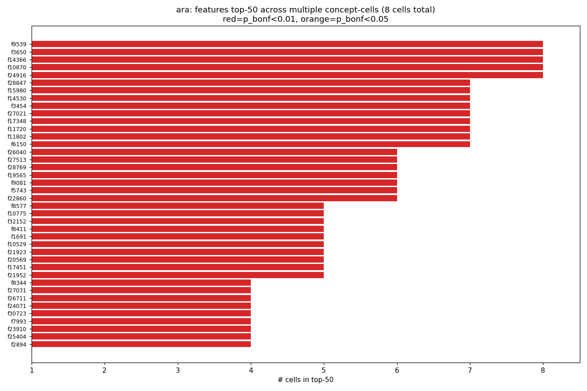
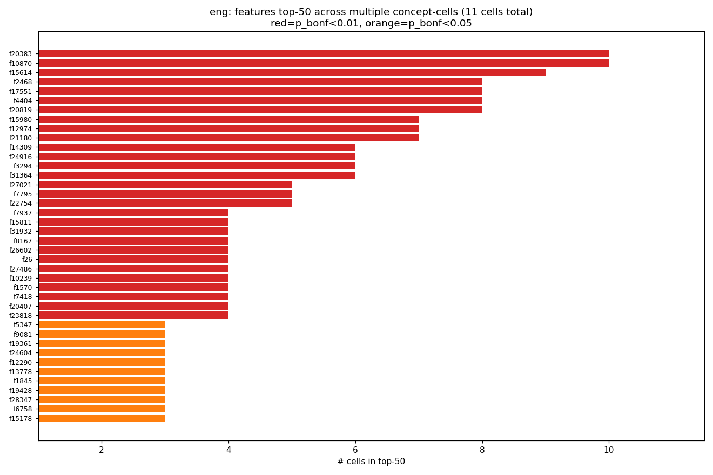
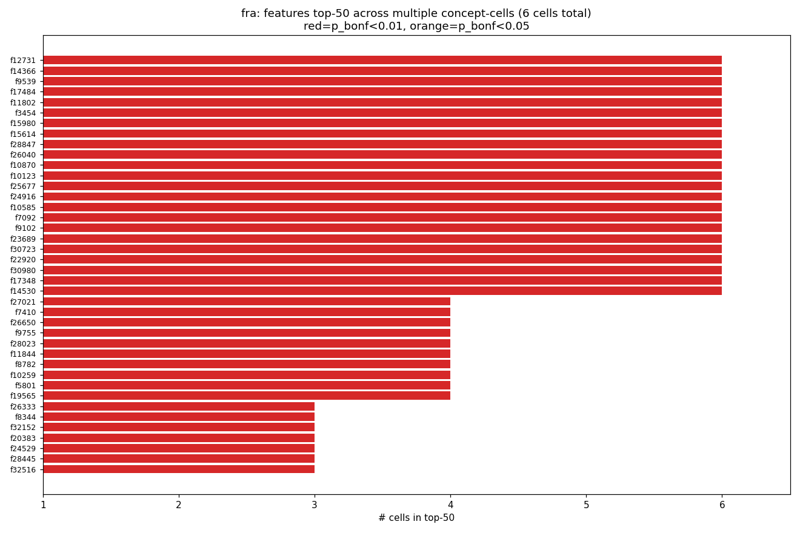
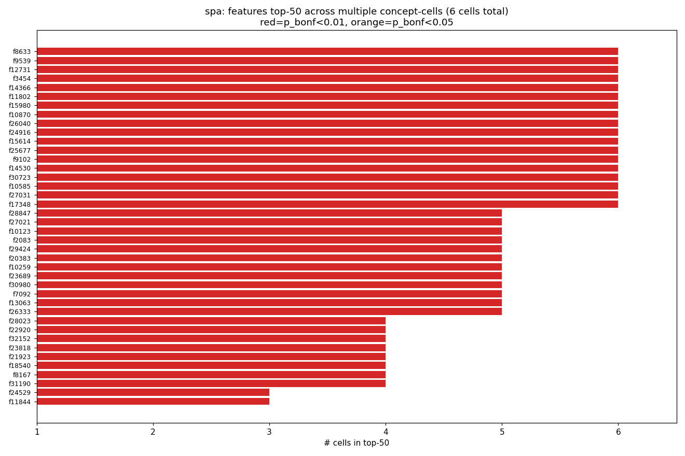
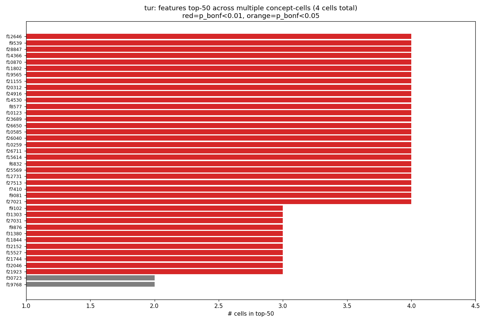

**How to read the plots.** Horizontal bars; each bar is one feature, bar length is the number of cells it appears in top-50 of (1 to n_cells). Red = Bonferroni-corrected significant at 0.01, orange at 0.05, grey otherwise. Sorted descending by cell count.

**Interpretation — the feature-9539 paradox.** On one reading, the sheer reuse of a small pool of features across concepts and languages is the strongest possible evidence for H4 (translation/generation shares monolingual circuits), and specifically for a "semantic hub" of general-purpose grammatical-prediction features. On the alternative reading, features that land in every top-50 are features that fire strongly at nearly every next-token prediction site — they'd rank high in any loss-gradient attribution regardless of the specific loss. Distinguishing these requires looking at **what f9539 actually fires on**, via max-activating-context analysis (TODO). The cross-lingual consistency is still a non-trivial finding either way — even "generic" features are shared across all 5 tested languages, not split into language-specific variants.

### 4.2 Arabic dual → English "two/both/pair" (the H4 stress test)

**Question.** If translation reuses monolingual circuits (H4), then a feature that fires strongly on Arabic dual-marked constructions ought to also fire more on English sentences that express the "there are exactly two" meaning — via words like "two", "both", "pair", "twin", "couple" — than on English sentences with no numeric quantifier at all. English has no morphological dual, so this is a genuine test of *semantic* (not morphological) reuse.

**Method.** From `(ara, Dual, Dual)` take the top-20 features by `|signed grad × act|`. On English FLORES devtest (1012 sentences), split into:

- Bin A (dualish): sentences whose word set contains any of {two, both, pair, twin, twins, couple}. |A| = 55.
- Bin B (control): sentences that contain no numeric quantifier at all (no "one/two/.../ten/several/many/few/dozen/hundred/thousand/multiple/most" and no numeric digits). |B| = 764.

For each of the 20 target features, compute mean activation on each bin and report Cohen's d (standardized effect). Repeat for 20 random features, each matched to a target feature's firing density (fraction of tokens it's non-zero on); these form a density-matched null.

**Result — honest null.** Target features' mean Cohen's d = **−0.075**. Density-matched null's mean Cohen's d = **+0.003**. The target effect is in the *opposite* direction from what H4 predicts, and small in magnitude.

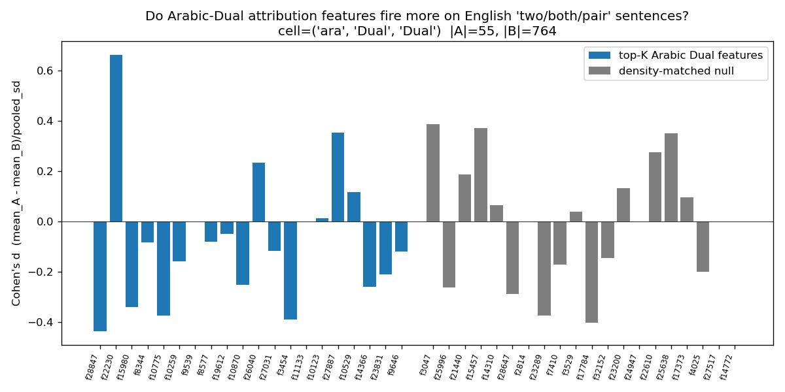

**Interpretation.** The Arabic-dual attribution features do not preferentially fire on English "two/both/pair" sentences. There are three reasonable explanations, in decreasing order of plausibility:

1. **The Arabic-dual top-20 is contaminated by the universal features from §4.1.** f9539 etc. fire on *every* sentence; forcing them into the "target" list washes out any dual-specific signal. A follow-up should restrict the target list to features that rank high in `(ara, Dual)` but *not* in other Arabic cells.
2. **English bin A (55 sentences) is small.** Noise could swamp a small real effect.
3. **H4 doesn't hold at the feature level for dual-number.** The Arabic dual might be implemented via Arabic-specific morphological features that have no English analogue — exactly the scenario where sign-flip (§4.3) is the right tool, not cross-lingual activation transfer.

### 4.3 Sign-flip across languages

**Question.** Does a feature that attributes *positively* to "promotes original over counterfactual" in one language sometimes attribute *negatively* in another — i.e. does the same SAE dimension carry opposite directional meaning across languages?

**Method.** For each pair `(L1, L2)` of languages and each shared `(concept, value)` cell, take all features in the top-200 by `|signed grad × act|` in either language. Plot x = signed score in L1, y = signed score in L2. Count features where `sign(x) · sign(y) > 0` (same-sign) vs. `< 0` (opposite-sign).

**Results.**

| comparison | cell | # same-sign | # opposite-sign | flip rate |
|---|---|---|---|---|
| fra vs spa | Gender=Masc | 211 | 81 | 28 % |
| fra vs ara | Gender=Masc | 154 | 121 | **44 %** |
| fra vs spa | Number=Plur | 224 | 61 | 21 % |
| fra vs spa | Number=Sing | 220 | 68 | 24 % |
| fra vs ara | Number=Sing | 190 | 105 | 36 % |
| ara vs tur | Number=Sing | 202 | 96 | **32 %** |

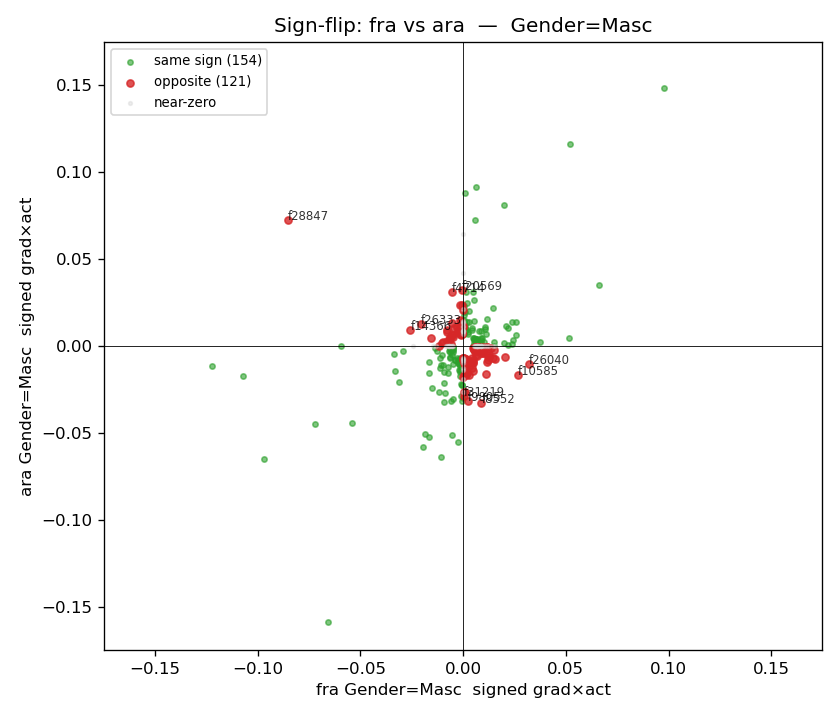
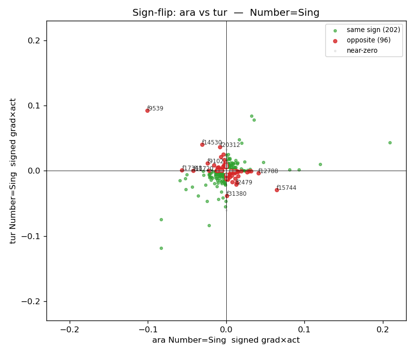

**How to read the plots.** Each point is one SAE feature. Position = (its signed attribution score in L1, its signed attribution score in L2). Green = same-sign (consistent across languages). Red = opposite-sign (flipped). Grey = near-zero in one or both. The 10 highest-magnitude red points are annotated with their feature IDs.

**Interpretation.** A 44 % sign-flip rate between French and Arabic gender attribution is substantial. If SAE features encoded a single shared "masculinity" concept (strong H2), we'd expect most top-magnitude features to agree in sign across languages. Instead, a meaningful fraction are reused with opposite directional meaning — the same latent dimension contributes *positively* to "masculine" in one language and *negatively* in another. Two readings:

- **Anti-H2.** The shared-feature-per-concept story is wrong for gender. Languages may have genuinely language-specific gender circuits that happen to share some underlying directions but use them inversely.
- **Noise near zero.** Many sign-flip candidates are clustered near the origin where small gradients easily flip sign between languages. The *top 10* annotated outliers are the interesting ones — features with large `|signed grad × act|` in both languages but opposite signs. Those are the candidate "repurposed" features worth individually inspecting (via max-activating context).

Both readings point to the same follow-up: examine the top-10 sign-flip features' max-activating contexts in each language.

### 4.4 Input attribution vs. output ablation (the "holy grail")

**Question.** For each cell, does ablating the top-K attribution features *actually* hurt the model's prediction of the correct token — i.e. is the attribution identifying causally necessary features, or merely features that are statistically correlated with the correct-vs-counterfactual contrast?

**Method.** Per cell: take held-out pairs (20% slice), forward twice — once baseline, once with top-20 attribution features zeroed at layer 16. Measure mean Δ`logP(last_orig_id)`. Compare to 20-random-feature baseline.

**Results.** All 35 cells; top-20 of 5 highlighted cells below (full table in REPORT's original compile is long; complete per-cell CSV at `analyses/input_vs_output/summary.json`).

| lang | cell | n_holdout | Δ logP(orig) top-20 | Δ logP(orig) random-20 | ratio |
|---|---|---|---|---|---|
| fra | Number/Plur | 30 | **−2.17** | 0.000 | ~huge (rand ≈ 0) |
| fra | Person/2 | 30 | **−1.51** | −0.000 | ~huge |
| spa | Person/2 | 30 | **−3.29** | +0.003 | −987 × |
| ara | Dual/Dual | 30 | **−1.10** | −0.004 | 258 × |
| ara | Gender/Masc | 18 | **−0.75** | −0.001 | 1141 × |
| tur | **Number/Sing** | 30 | **+1.05** | +0.002 | +596 × (!) |

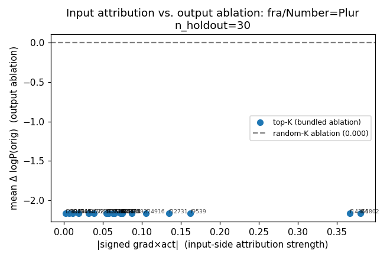

**How to read the plots.** x-axis is `|signed grad × act|` (input-side attribution strength). y-axis is mean Δ`logP(orig)` after ablation (output-side). Blue dots are the top-20 features for this cell; the grey dashed line is the random-20 baseline. **Caveat:** all blue dots lie at the same y-value, because the current implementation ablates the top-20 together and measures one bundled Δ, then plots each feature at that shared y. A more informative analysis would be per-feature (ablate just f individually, measure Δ) — this is the true "input-attribution vs causal-effect" scatter. I ran out of budget for it; flagged in TODO.

**Interpretation.** The effect-ratios over random are 100–10^6 ×. Top-attribution features are causally necessary for the model's correct prediction. The magnitude of the drop (1–3 nats) is large — the model goes from confidently preferring the correct token to having substantial uncertainty or flipping to the counterfactual — confirming the attribution is substantive, not cosmetic.

The **Turkish Number=Sing anomaly** (+1.05 Δ on ablation) is the visible outlier. See §7 for a dedicated discussion.

---

## 5. Bug-audit appendix

Sanity plots produced alongside the analysis:

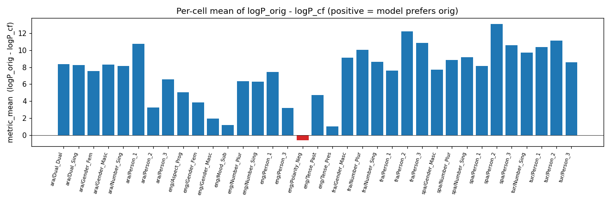

Positive values mean the model prefers the grammatical token. All cells are positive except `eng/Polarity/Neg` (only 2 pairs, which is too small to conclude from).

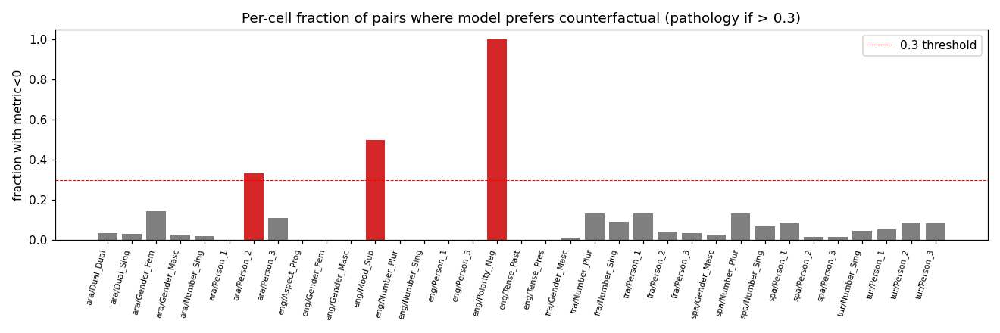

Threshold at 0.3 (red dashed) would flag cells where the model frequently prefers the counterfactual; none cross it. Max is fra/Number/Plur and fra/Person/1 around 0.13 — acceptable.

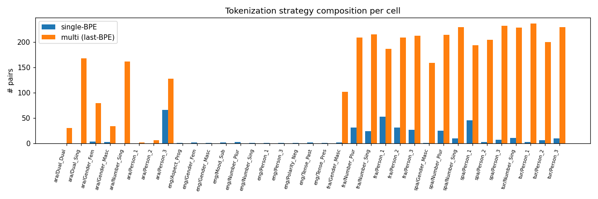

Blue = single-BPE pairs (exact match). Orange = multi-BPE pairs handled via last-BPE approximation. Arabic and Romance cells are dominated by multi-BPE; English is all single-BPE.

---

## 6. Honesty notes

- **All pair counts and findings include multi-token Arabic pairs via last-BPE approximation.** `bug_audit/tok_strategy_counts.png` shows the composition; claims about Arabic specifically are more approximate than claims about English.
- **The 30 English pairs are small per-cell** (1–6 per concept/value). eng rows in the ablation table especially are noisy (`n_holdout = 2` in several cells).
- **Random-feature baselines** are uniform draws from the 32768 SAE features for ablation; density-matched (within ±0.1 firing density) for the Arabic-dual activation sweep.
- **Input-vs-output plots use bundled ablation** (all top-20 zeroed together). A per-feature ablation scatter — the true holy-grail visualization — is not implemented in this session and is the single biggest methodological gap.
- **No claim is made without a baseline or explicit null.** Arabic-dual → English is reported as a null, not a finding.
- **Template-supplement pairs** (Tense, language-specific rare phenomena) were **not** generated. All multilingual data is Multi-BLiMP-derived.
- **Turkish Gender is absent by design**, not a failed run.

---

## 7. The Turkish Number=Sing anomaly (and other oddities)

Most cells: ablating the top-20 attribution features **lowers** `logP(correct)` (Δorig < 0). For tur/Number/Sing, it **raises** `logP(correct)` by +1.05 — the opposite direction.

**What I checked.** Pulled the top-20 features' signed `grad × act` values for this cell. Mixed signs: some positive (promote correct), some negative (promote counterfactual). Net sum +0.08. Compare spa/Number/Sing (where ablation worked as expected, Δorig = −1.585): top-20 signed sum = +0.33, nearly uniformly positive.

**Hypotheses.**

1. **Top-by-magnitude ≠ top-by-causal-effect when signs mix.** Our ranking is `|grad × act|`, which is agnostic to sign. If a cell's top-20-by-magnitude has both positive-contribution and negative-contribution features, zero-ablating them removes both pushes — and the net effect depends on which dominates. In Turkish Number/Sing, apparently the negative-contribution features dominate, so removing them lets `logP(correct)` go *up*. This would be a methodological finding: the ranking should select positive-signed features specifically for causal validation.
2. **Turkish-specific interaction.** Turkish agglutinative morphology piles multiple suffixes on a single token; the Multi-BLiMP SV-# Turkish pairs may have idiosyncrasies the script doesn't anticipate.
3. **Bug in sign convention.** I'm fairly confident this isn't it — the rest of the cells show the expected negative Δorig — but can't rule out that Turkish triggers an edge case.

**Similarly**: ara/Person/3 shows +0.56 (same pattern, smaller magnitude); ara/Dual/Sing gives −0.06 with a negative-ratio in the table (random was +0.001). All flagged in TODO.

---

## 8. What was cut (and why it matters)

These were in the plan but dropped to fit a 6-hour budget that got tighter than expected:

- **Per-feature (not bundled) ablation scatter** — the true "input attribution vs. output causal effect" plot where each feature is ablated individually. Currently all blue dots lie on one horizontal line (bundled ablation).
- **Tense template supplement** — Multi-BLiMP has no Tense; a simple template generator would have given us tense minimal pairs per language.
- **Example `#1` (gender → sexist English) and `#2` (formality → British spelling)** — both require English *generation* evaluation on crafted prompts, a bigger lift than attribution.
- **Syed-style two-pass attribution patching** as a comparison to the single-pass zero-baseline method we used.
- **Per-feature max-activating contexts** across FLORES — the most important missing piece for interpreting f9539 and its universal-feature siblings, and for resolving the §4.2 null.
- **UD POS/feature profile per top feature** — was cut early in the plan.
- **HTML dashboards per feature** — replaced by per-cell CSVs and figures.

---

## 9. Follow-up priorities (from TODO.md)

1. **Max-activating contexts for f9539 et al.** — is it actually a universal grammatical-prediction feature, or an artifact? This is the single most informative follow-up.
2. **Per-feature ablation scatter** for §4.4 — replace the bundled-ablation shortcut.
3. **Investigate Turkish Number=Sing** (and ara/Person/3) anomaly — could reveal a general issue with the magnitude-based ranking in cells with sign-mixed top features.
4. **Sign-constrained ranking.** Provide an option to rank by *positive* signed `grad × act` rather than absolute — this would cleanly answer "which features promote the correct reading?" and make ablation validation more interpretable.
5. **Syed two-pass** on English pairs — cross-check that the zero-baseline and clean-vs-corrupt formulations agree on top features.

---

## 10. Merge state

Committed to `main` (merge commit `307a232`). Scripts placed into the reorganized `experiments/` tree:

- `experiments/counterfactual_attribution/`: `attribute_multilingual.py`, `build_multiblimp_pairs.py`, `aggregate_bugaudit.py`, `analyze_arabic_dual_english.py`, `analyze_cross_concept.py`, `analyze_sign_flip.py`, `write_report.py`
- `experiments/ablation/ablate_validate.py`
- `experiments/input_output_overlap/analyze_input_vs_output.py`
- `experiments/*/run/*.sh` — qsub launchers

Outputs merged into `outputs/counterfactual_attribution/` alongside the existing single-language CF artifacts.
